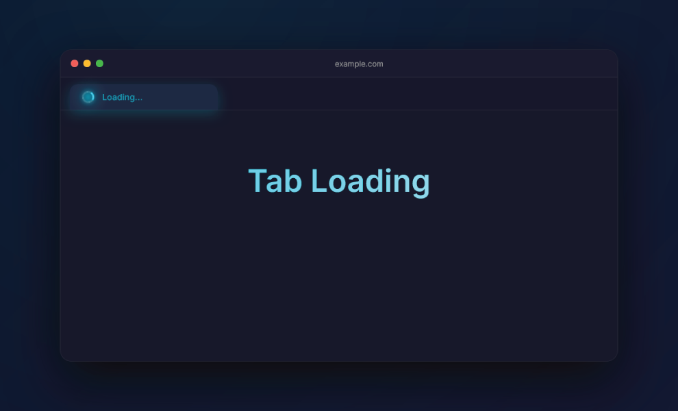

# Zen Better Tab Loading

A **premium mod** for **Zen Browser** that transforms the tab loading indicator into a modern spinner with neon glow, fluid rotation, and a smooth pulse in the title.

### Features
- Spinner with glass effect + radial glow
- Smooth rotation animation with slight scaling
- Elegant pulse on the tab title (can be toggled)
- Fully customizable color and glow intensity via Zen Mods panel
- Compatible with light and dark themes

### Why Manual Installation is Currently Required

The official Zen Mods store is in **partial freeze mode** (as stated in the official issue [#928](https://github.com/zen-browser/theme-store/issues/928)):

> “Mods are currently in partial freeze mode until we do some kind of refactoring to prevent so many issues between consecutive updates.”

Because of this, the **Import** button does not work correctly with manually created JSON files, it simply does nothing. And new mods are not being sent to the store.
The only reliable way to have the mod appear in the **Zen Mods** tab (with name, description, and editable preferences) is to follow the manual installation steps below.

### Installation

#### Method 1: Simple & Immediate

1. Open Zen Browser and go to `about:support`
2. Click **Open Folder** next to **Profile Directory**
3. Create a folder called `chrome` (if it doesn’t exist)
4. Copy the file `chrome.css` from this repository into the `chrome` folder and **rename it to `userChrome.css`**
5. Restart Zen Browser completely

The Better loading will appear immediately.

#### Method 2: Full Zen Mods Panel (with Preferences UI)

Use this method if you want the mod to appear in **Settings -> Zen Mods** with editable preferences (color, glow intensity, pulse toggle).

> [!CAUTION]
> 
> FIRST, BACK UP YOUR ALREADY INSTALLED MODS.
> - In Zen Browser, go to **Settings -> Zen Mods** 
> - Click **Export** to download your current mods list

1. Open your Profile Directory (`about:support` -> **Open Folder**)
2. Locate the file `zen-themes.json` (usually in the root of the profile folder)
3. Open it with any text editor
4. At the end of the JSON object (before the last `}`), add a comma `,` and then paste the entire content of the file [`zen-mod.json`](zen-mod.json) from this repository
5. Save the file
6. In Zen Browser, go to **Settings -> Zen Mods**
7. Click **Export** to download your current mods list
8. Click **Import** and select the exported file you just downloaded

The mod **Better Tab Loading** will now appear in the list, fully enabled, with preferences available.

### Screenshot

### Tips
- If you still see the hourglass on Windows, set `ui.prefersReducedMotion` to **0** in `about:config`
- You can edit color, glow intensity and pulse directly in the Zen Mods panel once Method 2 is done

---

Made with ❤️ for the Zen Browser community.  
Feel free to open issues or submit PRs!
